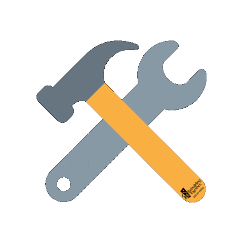

<h1 align="center">
  Hi there , I'm Yug Patel
</h1>

  

  
  
  

  📄 <a href="./assets/Yug Patel Resume.pdf">View My Resume</a> •
  🌐<a href="https://yugdev.netlify.app/">Visit Portfolio</a> •
  📧 <a href="mailto:yjpatel1275@gmail.com">Contact Me</a>

---

## About Me

I am a **Computer Science Engineering student** passionate about building clean and user-friendly web applications. I enjoy turning ideas into practical digital solutions.

🔭 **Current Focus:** Full-stack web development & responsive applications

🌱 **Currently Learning:** Modern JavaScript and backend with Node.js

⚒️ **Experience:** Internship at **Prasidh Foundation (NGO)** and participation in hackathons

💬 **Ask me about:** HTML, CSS, JavaScript, and responsive web design

 

---

##  Tech Stack & Tools

### Languages

### Frameworks & Libraries

### Databases

### Tools & Platforms

### Data & Visualization

### Other Tools

---

## 🏆 Featured Projects

<table>
<tr align = 'center'>

<td width="50%">

### LinkHub

Interactive link hub to manage social and professional profiles seamlessly.

🔗 **[View Project](https://linkhubyug.netlify.app/)**

</td>

<td width="50%">

### SiteCraft

Website built for my father’s civil construction business to showcase services and projects.

🔗 **[View Project](https://sitedotcraft.netlify.app/)**

</td>

</tr>

<tr align = 'center'>

<td width="50%">

### HealthCare Pro

Web-based healthcare management system for appointments and patient records.

🔗 **[View Project](#)**

</td>

<td width="50%">

### Infra Vision

AI-powered platform for planning green hydrogen infrastructure.

🔗 **[View Project](https://www.linkedin.com/posts/yugpatel040205_hackout2025-greenhydrogen-ai-activity-7368342207663165441-0ZzW?utm_source=share&utm_medium=member_desktop&rcm=ACoAAEoxx1MBxpAVLgFTStRlKwimeHdw8uoe8xs)**

</td>

</tr>
</table>

---
## 📌 Fun Facts

- 🎸 I love playing musical instruments  
- 🏏 Cricket is my go-to weekend sport  
- 💬 Ask me about frontend dev or NGO work

---

##  Let's Connect

 

---

Developed with ❤️ by <b>Yug Patel</b>

